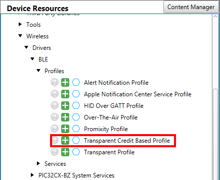

# PIC32CXBZ2_WBZ45x_BLE_TRANSPARENT_CREDIT_BASED_PROFILE


> "IoT Made Easy!" - This repository gives the details to create an MCC base project from scratch that includes all code and Firmware architecture to use Transparent Credit Based Profile through easy-to-use set of APIs

Devices: **PIC32CXBZ2 | WBZ45x**<br>
Features: **BLE | Transparent Credit Based Profile | Smartphone App | Android**

## ⚠ Disclaimer

<p><span style="color:red"><b>
THE SOFTWARE ARE PROVIDED "AS IS" AND GIVE A PATH FOR SELF-SUPPORT AND SELF-MAINTENANCE. This repository contains example code intended to help accelerate client product development. </br>

For additional Microchip repos, see: <a href="https://github.com/Microchip-MPLAB-Harmony" target="_blank">https://github.com/Microchip-MPLAB-Harmony</a>

Checkout the <a href="https://microchipsupport.force.com/s/" target="_blank">Technical support portal</a> to access our knowledge base, community forums or submit support ticket requests.
</span></p></b>

## A la carte

1. [Introduction](#step1)
1. [Bill of materials](#step2)
1. [Hardware Setup](#step3)
1. [Software Setup](#step4)
1. [MCC Harmony Configuration](#step5)
1. [Embedded Application Development](#step6)
1. [Board Programming](#step7)
1. [Smartphone Application](#step8)
1. [Run the demo](#step9)


## Introduction<a name="step1"></a>

This solution demonstrates how to enable fast data transfer between Bluetooth Low Energy Microchip hardware and Android Phone App.

The Microchip software tools is offering an easy way to configure graphically the BLE stack running on the WBZ45x BLE 5.2 Wireless device. This solution is showing how to easily implement a Transparent Credit Based profile in order to speed-up the data transfer. Comparing to the Transparent UART profile which is using the normal GAP/GATT layers, the BLE Credit Base pipe service creates a L2CAP data channel that allow high speed data transfer over BLE. 

Logical Link Control and Adaptation Protocol (L2CAP) is a protocol used in the Bluetooth standard that provides adaption between higher layers and the baseband layer of the Bluetooth stack.

<!--
Below a short table comparing Transparent UART profile and Transparent Credit Based Profile with L2CAP implementation.

| Profile | Transparent UART | Transparent Credit Based Profile |
| ------- | ---------------- | -------------------------------- |
| Underneath layer | GATT/GAP | L2CAP |
| PROs | - easy to use and seen as a serial link/transparent pipe over BLE</br>- what you send in ASCII format from a device is what you get to the peer device</br>- no need to be a BLE expert | - standard implementation defined in the Bluetooth specs</br>- easy to use because interaction with the L2CAP layer is typically handled by the BLE stack</br>- higher throughput than normal GAP/GATT implementation |
| CONs | - custom implementation, generally requires more time on phone App development</br>- requires more data processing</br>- data transfer speed goes down as much as there is data to transfer</br>- limitations on the memory and the buffer size | 

-->

Moreover, several benefits of Transparent Credit Based Profile with Android:
* L2CAP is standard in Android (minimum Android 10 is required) and in iOS too
* Bluetooth object in operating system, Bluetooth sock is a default object, you treat that link as a normal BSD socket
* well suited for less than 500kB of data to transfer
* able to reach 100kbpsec throughput with Android

## Bill of materials<a name="step2"></a>

* [PIC32CX-BZ2-WBZ451-EA Curiosity Board](https://www.microchip.com/en-us/development-tool/EA71C53A)

* Smartphone with Android 12 (e.g. Samsung SM-G981B)

## Hardware Setup<a name="step3"></a>

Simply plug the WBZ45x Curiosity Board to the computer using a micro-USB cable

## Software Setup<a name="step4"></a>

The sample project has been created and tested with the following Software Development Tools:
- [MPLAB X IDE v6.00](https://www.microchip.com/en-us/development-tools-tools-and-software/mplab-x-ide)
- [MPLAB X IPE v6.00](https://www.microchip.com/en-us/development-tools-tools-and-software/mplab-x-ide)
- [MPLAB XC32 v4.10](https://www.microchip.com/en-us/development-tools-tools-and-software/mplab-xc-compilers)
- PIC32CX-BZ_DFP v1.0.107
- [MPLAB Code Configurator v5.1.17](https://www.microchip.com/en-us/tools-resources/configure/mplab-code-configurator)
   - [bsp v3.13.0](https://github.com/Microchip-MPLAB-Harmony/bsp/tree/v3.13.0)
   - [csp v3.13.1](https://github.com/Microchip-MPLAB-Harmony/csp/tree/v3.13.1)
   - [wireless_pic32cxbz_wbz v1.0.0](https://github.com/Microchip-MPLAB-Harmony/wireless_pic32cxbz_wbz/tree/v1.0.0)
   - [core v3.11.1](https://github.com/Microchip-MPLAB-Harmony/core/tree/v3.11.1)
   - [wireless_ble v1.0.0](https://github.com/Microchip-MPLAB-Harmony/wireless_ble/tree/v1.0.0)
   - [dev_packs v3.13.1](https://github.com/Microchip-MPLAB-Harmony/dev_packs/tree/v3.13.1)
   - [wolfssl v4.7.0](https://github.com/Microchip-MPLAB-Harmony/wolfssl/tree/v4.7.0)
   - [crypto v3.7.6](https://github.com/Microchip-MPLAB-Harmony/crypto/tree/v3.7.6)
   - [CMSIS-FreeRTOS v10.4.6](https://github.com/Microchip-MPLAB-Harmony/CMSIS-FreeRTOS/tree/v10.4.6)

*Remark:</br>- wolfSSL and crypto components are both required by the BLE stack for resolvable address calculation and Over the Air (OTA) update feature.*

The following additional software tools are required for running the project:
- Any Serial Terminal application like [Tera Term](https://osdn.net/projects/ttssh2/releases/) terminal application

## MCC Harmony Configuration<a name="step5"></a>

### Pre-requisites

* Update the PIC32CX-BZ DFP from *Tools -> Packs*

<p align="center">

</p>

* Install MPLAB Code Configurator from *Tools -> Plugins*

* Check the Harmony Content Path from *Tools -> Options -> Plugins -> MPLAB Code Configurator 5.x*
  * Folder name should not exceed 4 characters
  * It is recommended to start from an empty and fresh folder if you have configured MPLAB Code Configurator with an Early Adopter package

<p align="center">

</p>

### Synchronize the Harmony components

* Create a new *32-bit MCC Harmony Project* to clone the Harmony repositories from GitHub using *File -> New project*

<p align="center">

</p>

* Select *WBZ451* as target device
* Select the folder of your choice
* Open *MPLAB Code Configurator (MCC)* 
* Select *MPLAB Harmony*
* From the *Optional Content*
  * Tick the basic components required (bsp, core, zlib, crypto, wolfssl, CMSIS FreeRTOS)
  * Tick all the components related to PIC32CX-BZ
    * [wireless_pic32cxbz_wbz](https://github.com/Microchip-MPLAB-Harmony/wireless_pic32cxbz_wbz)
    * [csp_apps_pic32cxbz2_wbz45](https://github.com/Microchip-MPLAB-Harmony/csp_apps_pic32cxbz2_wbz45)
    * [core_apps_pic32cxbz2_wbz45](https://github.com/Microchip-MPLAB-Harmony/core_apps_pic32cxbz2_wbz45)
    * [wireless_apps_pic32cxbz2_wbz45](https://github.com/Microchip-MPLAB-Harmony/wireless_apps_pic32cxbz2_wbz45)
    * [wireless_ble](https://github.com/Microchip-MPLAB-Harmony/wireless_ble)
    * [wireless_system_pic32cxbz_wbz](https://github.com/Microchip-MPLAB-Harmony/wireless_system_pic32cxbz_wbz)
  * Click *Finish*

* Configure the components using *Content Manager*

<p align="center">

</p>

* Align the versions of each Harmony components with tested versions mentioned on [Software Setup](#step4) section

<p align="center">

</p>

* Close this project from *File -> Close Project*

### Getting started with BLE Transparent Credit Based Profile Application

**Step 1** - Connect the WBZ451 Curiosity board to the computer using a micro-USB cable

**Step 2** - Create a new MCC Harmony project in MPLAB X IDE

<p align="center">

</p>

**Step 3** - Configure SERCOM0

* Select the *System* component from the *Project Graph* tab
  * Expand the configuration *System -> Device & Project Configuration -> WBZ451 Device Configuration -> DEVCFG1*
  * Set **SERCOM0 Direct (High Speed) Pin Enable (SCOM0_HSEN) = DIRECT**

<p align="center">

</p>

* From the *Device Resources* window, add **SERCOM0 Peripheral Library** located in *Libraries -> Harmony -> Peripherals -> SERCOM*

* In the *Project Graph*, select *SERCOM0*
  * Set **Receive Pinout = SERCOM PAD[1] is used for data reception**
  * Set **Transmit Pinout = PAD[0] = TxD; PAD[2] = RTS; PAD[3] = CTS**

<p align="center">

</p>

**Step 4** - Configure Transparent Credit Based Service

<p align="center">

</p>

* From the *Device Resources* window, add **Transparent Credit Based Service** located in *Libraries -> Harmony -> Wireless -> Driver -> BLE -> Services*
  * Activate the following components
    * BLE Stack (BLE_STACK_LIB)
    * Device_support (pic32cx_bz2_devsupport)
    * Core (Harmony Core)
    * FreeRTOS (FreeRTOS)
    * PDS_SubSystem (pdsSystem)
    * NVM (nvm)
    * Cryptographic (Crypto) Library (lib_crypto)
    * wolfCrypt Library (lib_wolfcrypt)
  * Make the following connections
    * Lib_crypto:LIB_CRYPTO_WOLFCRYPT_Dependency -> lib_wolfcrypt:lib_wolfcrypt
    * BLE_STACK_LIB:BLE_Wolfcrypt_Dependency -> lib_wolfcrypt:lib_wolfcrypt
    * pdsSystem:NVM_Dependency -> nvm:NVM_MEMORY

**Step 5** - Configure Transparent Credit Based Profile

* From the *Device Resources* window, add **Transparent Credit Based Profile**

<p align="center">

</p>

* Make a link between *Transparent Credit Based Profile* and *Transparent Credit Based Service* using the right click on the Yellow or Red diamond

<p align="center">

</p>

* In the project graph, select *Transparent Credit Based Profile*
  * Enable **Server Role**

<p align="center">

</p>

**Step 6** - Configure BLE Stack

* Select the *BLE Stack* component from the *Project Graph* tab
  * Enable **Credit Based Flow Control** from the L2CAP configuration

<p align="center">

</p>

**Step 7** - Project Graph should be like the one below

<p align="center">

</p>

**Step 8** - Generate the code

* Click the *Generate* button

<p align="center">

</p>

* Wait until the generation is over

**Step 9** - Configure the project

* Open the **Project Properties** from *File -> Project Properties*
* Select the **WBZ451 Curiosity board** connected
* Select the CMSIS, the DFP and the compiler toolchain

<p align="center">

</p>

* Click **Apply** and the **Ok**

**Remarks: At this point, compiling the project should provide errors and user actions are required**

**Step 10** - Modify the generated code (mandatory)

* Open the file *app_user_edits.c*
  * Comment the line `#error User action required`

* Open the file *freertos_hooks.c* located in *config/default*
  * Add the line `#include "definitions.h`
  * Add the function call `app_idle_task();` inside the function `vApplicationIdleHook()`

<p align="center">


</p>

*Remark: At this point, the project should compile with no error and the project is ready for application development*

## Embedded Application Development<a name="step6"></a>

The folder *dev_files* contains the files *blecb_pipe.c* and *blecb_pipe.h* that implement the BLE Credit Base pipe service. It creates a L2CAP data channel that allow high speed data transfer over BLE

**Step 1** - Include BLE Credit Base Pipe source files to project

* Copy the files *blecb_pipe.c* and *blecb_pipe.h* into the *src* folder of the MCC project path (e.g. *c:/ble_cbp/firmware/src*)

* Add the two files to the project
  * In the MPLAB Project tab, right click on the *Header Files* project directory
  * Select *Add Existing Item*
  * Search for the copied file *blecb_pipe.h* and click *Select*
  * Now, right click on the *Source Files* project directory
  * Search for the copied file *blecb_pipe.c* and click *Select*

<p align="center">

</p>

**Step 2** - Customize the BLE Credit Base Pipe

* Open the file *blecb_pipe.h* to find the settings of the data queue length and maximum allocation space in bytes

```
#define BLECB_Pipe_DATA_QUEUE_MAX_ELEMENTS     255
#define BLECB_Pipe_DATA_QUEUE_MAX_ALLOC        10240
```

**Step 3** - Run the BLE Credit Base Pipe task

The BLE Credit Base Pipe implementation is creating a FreeRTOS task and handle the task queues (Rx queue as well as Tx queue). It is necessary to maintain the state machines of this add-on module to the main while loop.

* Open the file *main.c*
* Include the file *blecb_pipe.h*

```
#include "blecb_pipe.h"
```

* Make a call to `BLECB_PipeTask()` function before the call to `SYS_Tasks()` in the main infinite loop

```
while ( true )
{
   BLECB_Pipe_Task();
   SYS_Tasks();
}
```

**Step 4** - Modify the application file *app.h*

* Open the file *app.h*
* Add two new application states in the `APP_STATES` enumeration

```
APP_STATE_RXQUEUE_FULL,
APP_STATE_STOP
```

* Add the following message id in the definition of `enum APP_MsgId_T`

```
,
APP_MSG_BLECB_PIPE_CONNECTED,
APP_MSG_BLECB_PIPE_DISCONNECTED,
APP_MSG_BLECB_PIPE_PHY_UPDATED,
APP_MSG_BLECB_PIPE_FILE_TX_START,
APP_MSG_BLECB_PIPE_FILE_TX_END,
APP_MSG_IDLE 
```

* Define a new extern `uint8_t` variable called `phyInUse`
```
extern uint8_t phyInUse;
```

* Add the prototypes of the following functions

```
void Debug_Uart_Write_blocking(uint8_t *data, uint16_t length);
void Debug_Uart_Write(uint8_t *data, uint16_t length);
```

**Step 5** - Modify the application file *app.c*

* Open the file *app.c*
* Include the file *blecb_pipe.h*

```
#include “blecb_pipe.h”
```

* In the local functions section, add the following code to write debug messages over UART using the SERCOM0 which is configured by default in non-blocking mode (polling)

```
/**
 * DEBUG UART BLOCKING WRITE
 * @param data
 * @param length
 */
void Debug_Uart_Write_blocking(uint8_t *data, uint16_t length)
{
    SERCOM0_USART_Write(data, length);
    while(SERCOM0_USART_WriteIsBusy());
}

/**
 * DEBUG UART NON-BLOCKING WRITE
 * @param data
 * @param length
 */
void Debug_Uart_Write(uint8_t *data, uint16_t length)
{
    SERCOM0_USART_Write(data, length);    
}
```

**Step 6** - Add necessary code in *app.c* to handle the received BLE data

* Define a callback function to receive data from the BLE CB pipe and print the data received using the SERCOM0 PLIB APIs
  * For the callback function, refer to the function `typedef void (* pipedatarecived_callback)(uint8_t *, uint16_t)` defined in *blecb_pipe.h*
  * For printing data over UART, refer to the function `SERCOM0_USART_Write(uint8_t *, uint16_t)` and to the function `SERCOM0_USART_WriteIsBusy()` for blocking-mode operations 
  * For the purpose of this demo and to speed down the transfer, we are going to print asterisk characters when the data length is higher or equal to 64 and print the character received when data length is lower

```
/**
 * CALLBACK FOR PROCESSING EACH RECEIVED MESSAGE
 * @param data
 * @param length
 */
void BLE_Rx_Callback(uint8_t *data, uint16_t length)
{
    if (length >= 64)
    {   // print '*' if length >=64
        SERCOM0_USART_Write((uint8_t *)"*", 1);
    }
    else
    {
        SERCOM0_USART_Write(data, length);        
    }
    while(SERCOM0_USART_WriteIsBusy());
}
```

**Step 7** - Add necessary code in *app.c* to configure the Bluetooth device address

* In `APP_Tasks()` function, locate the initial application state `APP_STATE_INIT`
  * Just after the initialization of the BLE stack (`APP_BleStackInit()`), set a public Bluetooth Device address using the API `BLE_GAP_SetDeviceAddr()`
  * Pick up a Bluetooth Device Address generated for the purpose of this demo <a href="docs/BLECB_Pipe_MAC.docx" target="_blank">here</a> or simply select your own address


Implementation example for BD address - A6:A5:A4:A3:B2:B2

```
// Configure Bluetooth device address
BLE_GAP_Addr_T devAddr;
devAddr.addrType = BLE_GAP_ADDR_TYPE_PUBLIC;
devAddr.addr[0] = 0xB1;
devAddr.addr[1] = 0xB2;
devAddr.addr[2] = 0xA3;
devAddr.addr[3] = 0xA4;
devAddr.addr[4] = 0xA5;
devAddr.addr[5] = 0xA6;
BLE_GAP_SetDeviceAddr(&devAddr); 
```

**Remarks: The Bluetooth device address populated here for the embedded device will be set later in the Smartphone Application to enable a Bluetooth connection to this particular device only**

**Step 8** - Add necessary code in *app.c* to initialize the BLE Credit Base pipe service

* In `APP_Tasks()` function, locate the initial application state `APP_STATE_INIT`
  * Following the setting of the BD address, initialize the BLE Credit Base pipe service using the function `BLECB_Pipe_Init(pipedatarecived_callback rxcallback)`. The function `BLECB_Pipe_Init` requires the Rx callback function defined previously as parameter
  * Use the local function `Debug_Uart_Write_blocking()` to write message on the UART console

```
BLECB_Pipe_Init(BLE_Rx_Callback);
Debug_Uart_Write_blocking((uint8_t *)"\n-> Initialized", 15);
```

**Step 9** - Add necessary code in *app.c* to start BLE advertising

* In `APP_Tasks()` function, locate the initial application state `APP_STATE_INIT`
  * After the initialization of the BLECB Pipe service, start BLE advertising using the function `BLE_GAP_SetAdvEnable()` defined in the file *ble_gap.h*
 * Use the local function `Debug_Uart_Write_blocking()` to write message on the UART console

```
BLE_GAP_SetAdvEnable(0x01, 0x00);
Debug_Uart_Write_blocking((uint8_t *)"\n-> Start Advertising", 21);
```

**Step 10** - Add necessary code in *app.c* to manage the data queue

* In `APP_Tasks()` function, locate the state `APP_STATE_SERVICE_TASKS`
  * In the event `APP_MSG_BLE_STACK_EVT`
    * In the default code, the application is passing BLE stack event message to user application for handling. For this implementation, this needs to be changed.
    * The code needs to intercept the new message entering the queue and pass it to the BLE Credit Base Pipe event handler using the function `BLECB_Pipe_Event_Handler()` prior to call the default BLE stack handler
    * After message interception, the code should exit correctly from the task. For that, check the returned value of the function `BLECB_Pipe_Event_Handler()` to know if the event has been consumed. If it has been consumed, the code can exit the function preventing the default handler to process the event again

```
if(p_appMsg->msgId==APP_MSG_BLE_STACK_EVT)
{
   bool eventConsumed = BLECB_Pipe_Event_Handler((STACK_Event_T *)p_appMsg->msgData);
   if (eventConsumed) return;
                    
   // Pass BLE Stack Event Message to User Application for handling
   APP_BleStackEvtHandler((STACK_Event_T *)p_appMsg->msgData);
}
```

* Optionally and after the previous step, add the following snippet of code to inform the user with messages on the different state of BLE CB Pipe (connected, disconnected, file transfer start, etc...)

```
else if(p_appMsg->msgId==APP_MSG_BLECB_PIPE_CONNECTED)
{
   SERCOM0_USART_Write((uint8_t *)"\n-> BLECB PIPE OPENED", 21);
}
else if(p_appMsg->msgId==APP_MSG_BLECB_PIPE_DISCONNECTED)
{
   SERCOM0_USART_Write((uint8_t *)"\n-> BLECB PIPE CLOSED", 21);
}
else if(p_appMsg->msgId==APP_MSG_BLECB_PIPE_PHY_UPDATED)
{
   if(phyInUse==BLE_GAP_PHY_OPTION_2M){
      SERCOM0_USART_Write((uint8_t *)"\n-> BLE PHY Updated to 2M", 25);
   }
   else{
      SERCOM0_USART_Write((uint8_t *)"\n-> BLE PHY Updated to 1M", 25);
   }
}
else if(p_appMsg->msgId==APP_MSG_BLECB_PIPE_FILE_TX_START)
{
   SERCOM0_USART_Write((uint8_t *)"\n",1);
}
else if(p_appMsg->msgId==APP_MSG_BLECB_PIPE_FILE_TX_END)
{
   SERCOM0_USART_Write((uint8_t *)p_appMsg->msgData,51);
}
```

**Remarks: At this point, the project should compile with no error and the project is ready for next step**

**Step 11** - Add necessary code in *app.c* to transmit BLE data

Sending data can be achieve easily by putting data into the queue through the API `BLECB_Pipe_SendData(BLECB_Pipe_SendData(uint8_t * msg, uint16_t size)`

The instructions below are providing guidance to send a message on a user button press.

* Open `app.c`
* Search for the section : *Global Data Definitions*
  * Define a MACRO to identify the GPIO which is connected to the user button of the board
  * Declare a global boolean variable to check if user button is pressed
  * Declare a task to check periodically the user button

```
#define APP_KEY_PB4  0x10
bool USERKEY_PRESSED;
TaskHandle_t xBUTTON_Task;
```

* Search for the section : *Application Local Functions*
  * Write a function to check if user button is pressed
  * Write the task which send a message if the user key has been pressed

```
/**
 * CHECK IF USER BUTTON IS PRESSED
 * @return 
 */
bool CheckUserKeyPressed( void )
{
    if(!USERKEY_PRESSED)
    {
        if ((GPIOB_REGS->GPIO_PORT & APP_KEY_PB4) == 0)
        {
            USERKEY_PRESSED = true;
            return true;
        }
    }else
    {
        if ((GPIOB_REGS->GPIO_PORT & APP_KEY_PB4) != 0)
        {
            USERKEY_PRESSED = false;
        }
    }
    return false;
}
```

```
/**
 * USER BUTTON CHECK TASK
 * @param pvParameters
 */
void _BUTTON_Task(  void *pvParameters  )
{   
    while(1)
    {
        if(CheckUserKeyPressed())
        {
            Debug_Uart_Write_blocking((uint8_t *)"\n-> Pressed", 11);
            BLECB_Pipe_SendData((uint8_t *)"Message from WBZ451\r\n",21);
        }
    }
}
```

* Go to `APP_Initialize()` function located in the section *Application Initialization and State Machine Functions*
  * Create a new FreeRTOS task for managing the button

```
xTaskCreate((TaskFunction_t) _BUTTON_Task,
            "BUTTON_Task",
            1024,
            NULL,
            1,
            &xBUTTON_Task);
```

* In `APP_Tasks()` function, locate the initial application state `APP_STATE_INIT`
  * Add the necessary code to initialize the GPIO as an input for checking the button state

```
//--- USER KEY INIT
GPIOB_REGS->GPIO_ANSELCLR = APP_KEY_PB4;
GPIOB_REGS->GPIO_TRISSET =  APP_KEY_PB4;
USERKEY_PRESSED = false;
```

*Well done, you have implemented all the code to enable bi-directional BLE communication using the BLE Credit Based Pipe service*


**Step 12** - Compile the project

**Remarks: At this point, the project should compile with no error and the project is ready for the next step**

## Board programming<a name="step7"></a>

Make sure the WBZ451 Curiosity board is plugged to the computer through a micro-USB cable.

### Program the precompiled hex file using MPLAB X IPE

Using MPLAB IPE:
* Select **WBZ451** as Device flash and hit the *Apply* button
* Select the tool connected: **Curiosity/Starter Kits (PKOB4)**
* Browse for the following file: *hex/ble_cbp.X.production.hex*
* Hit the *Program* button


### Build and program the application using MPLAB X IDE

Using MPLAB IDE:
* Check the settings in the project properties

<p align="center">

</p>

* Compile the application by clicking on the *Clean and Build* button
* Program the application to the device by clicking on the *Make and Program* button

## Smartphone Application<a name="ste8"></a>

The CBP application has been developped specifically for the purpose of this demo. This repository the APK file as well as the Android Studio project.

In Android Studio, the code has been divided in two blocks for a simple usage. 

The Credit base pipe project is composed of a single file which:

1) Define the BLECB_Pipe object
2) Initialize the object with `blecbPipe.init()`
3) And then the following API used to connect `blecbPipe.Connect()` by providing as arguments the Bluetooth Device Address of the target and the callback of the received bytes

It is recommended to use the CBP library (.aar) as is and import it on your own project. 


## Run the demo<a name="step9"></a>

- Open the CBP App on the Android phone
- Select the menu button on the upper right corner
- Set the BLE MAC of the peer device using QR Code scan or type the address manually

<p align="center">


</p>

- Click *Connect*

<p align="center">

</p>

- Send a message or a file from the Smartphone App to the peer device

<p align="center">


</p>

- Press the user button from the peer device and observe the message received on the Phone App

<p align="center">

</p>


<a href="#top">Back to top</a>